# DMVPN Fase 3 — IKEv2 con Enrutamiento Dinámico (EIGRP)

**Alumno:** Junior Javier Santos Perez  
**Matrícula:** 2024-1599  
**Plataforma:** Lab PNET  


Video demostrativo: https://www.youtube.com/watch?v=r7H2XeKSssE 

---

## Objetivo

Implementar una VPN hub-and-spoke punto a multipunto usando **DMVPN Fase 3** con **IKEv2** como protocolo de negociación de claves y **EIGRP** como protocolo de enrutamiento dinámico.

La Fase 3 de DMVPN mejora sobre la Fase 2 al introducir el mecanismo de **NHRP Redirect** en el Hub y **NHRP Shortcut** en los Spokes. Esto permite que el Hub informe activamente a los Spokes cuándo existe un atajo directo hacia otro Spoke, y que los Spokes instalen esa ruta de atajo en su tabla de routing automáticamente. A diferencia de la Fase 2, en Fase 3 el Hub **sí puede resumir rutas** porque NHRP gestiona el desvío del tráfico de forma independiente al plano de control de enrutamiento.

IKEv2 simplifica la negociación de seguridad respecto a IKEv1: usa solo 4 mensajes (vs 9 en IKEv1), soporta autenticación bidireccional nativa y es más resistente a ataques de denegación de servicio.

---

## Diferencias clave vs DMVPN Fase 2

| Aspecto | Fase 2 — IKEv1 | Fase 3 — IKEv2 |
|---|---|---|
| Negociación IKE | `crypto isakmp policy` | `crypto ikev2 proposal` + `policy` + `keyring` + `profile` |
| PSK | `crypto isakmp key` | `crypto ikev2 keyring` |
| Hub Tunnel10 | sin `nhrp redirect` | `ip nhrp redirect` |
| Spoke Tunnel10 | sin `nhrp shortcut` | `ip nhrp shortcut` |
| Hub puede resumir rutas | No | Sí |
| Atributo Spoke↔Spoke en `show dmvpn` | D | DX |
| Verificar IKE | `show crypto isakmp sa` → `QM_IDLE` | `show crypto ikev2 sa` → `READY` |

---

## Topología

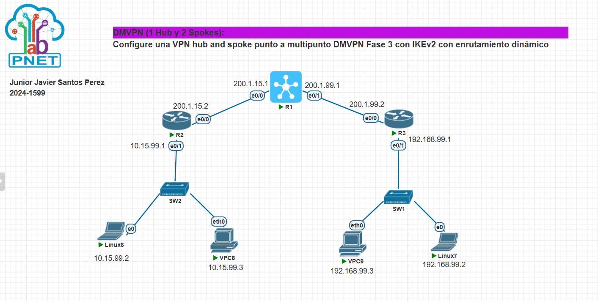

*IMAGEN1 — Topología del laboratorio: R1 como Hub central con dos interfaces WAN (e0/0: 200.1.15.1 y e0/1: 200.1.99.1), R2 como Spoke1 (200.1.15.2, LAN 10.15.99.0/24) y R3 como Spoke2 (200.1.99.2, LAN 192.168.99.0/24). Los hosts Linux6, VPC8, Linux7 y VPC9 representan los equipos finales de cada LAN.*

---

## Dispositivos y roles

| Dispositivo | Rol     | Descripción                       |
|-------------|---------|-----------------------------------|
| R1          | Hub     | Nodo central del DMVPN            |
| R2          | Spoke1  | Sitio izquierdo (LAN 10.15.99.0)  |
| R3          | Spoke2  | Sitio derecho (LAN 192.168.99.0)  |
| SW2         | Switch  | Conmutador LAN del Spoke1         |
| SW1         | Switch  | Conmutador LAN del Spoke2         |

---

## Direccionamiento IP

### Interfaces físicas (NBMA)

| Dispositivo | Interfaz | Dirección IP     | Red              |
|-------------|----------|------------------|------------------|
| R1 Hub      | e0/0     | 200.1.15.1/24    | Red hacia R2     |
| R1 Hub      | e0/1     | 200.1.99.1/24    | Red hacia R3     |
| R2 Spoke1   | e0/0     | 200.1.15.2/24    | Red NBMA         |
| R2 Spoke1   | e0/1     | 10.15.99.1/24    | LAN Spoke1       |
| R3 Spoke2   | e0/0     | 200.1.99.2/24    | Red NBMA         |
| R3 Spoke2   | e0/1     | 192.168.99.1/24  | LAN Spoke2       |

### Interfaz de túnel mGRE

| Dispositivo | Interfaz  | IP Túnel       |
|-------------|-----------|----------------|
| R1 Hub      | Tunnel10  | 172.16.0.1/24  |
| R2 Spoke1   | Tunnel10  | 172.16.0.2/24  |
| R3 Spoke2   | Tunnel10  | 172.16.0.3/24  |

### Hosts

| Host   | Interfaz | IP               | Gateway        |
|--------|----------|------------------|----------------|
| Linux6 | e0       | 10.15.99.2/24    | 10.15.99.1     |
| VPC8   | eth0     | 10.15.99.3/24    | 10.15.99.1     |
| Linux7 | e0       | 192.168.99.2/24  | 192.168.99.1   |
| VPC9   | eth0     | 192.168.99.3/24  | 192.168.99.1   |

---

## Parámetros de configuración

### IKEv2 — Propuesta

| Parámetro     | Valor        |
|---------------|--------------|
| Cifrado       | AES-CBC-128  |
| Integridad    | SHA1         |
| Grupo DH      | 2            |
| PRF           | SHA1         |

### IKEv2 — Autenticación

| Parámetro           | Valor        |
|---------------------|--------------|
| Método              | Pre-shared   |
| PSK                 | cisco123     |
| Hub acepta peer     | 0.0.0.0/0    |
| Spokes apuntan a    | 200.1.15.1   |
| Lifetime            | 86400 seg    |

### IPSec

| Parámetro          | Valor        |
|--------------------|--------------|
| Transform-set      | DMVPN-SET    |
| Encriptación ESP   | AES          |
| Autenticación ESP  | SHA-HMAC     |
| Modo               | Transport    |
| Perfil IPSec       | DMVPN-PROF   |

### NHRP

| Parámetro             | Valor        |
|-----------------------|--------------|
| Network-ID            | 100          |
| Autenticación         | dmvpn1       |
| NHS (IP túnel Hub)    | 172.16.0.1   |
| NHS (NBMA Hub)        | 200.1.15.1   |
| Hub: nhrp redirect    | Sí           |
| Spokes: nhrp shortcut | Sí           |

### EIGRP

| Parámetro    | Valor |
|--------------|-------|
| AS Number    | 100   |
| Auto-summary | Off   |

---

## Configuración completa

### Paso 1 — Interfaces físicas

**R1 Hub:**
```
conf t
interface e0/0
 ip address 200.1.15.1 255.255.255.0
 no shut
interface e0/1
 ip address 200.1.99.1 255.255.255.0
 no shut
```

**R2 Spoke1:**
```
conf t
interface e0/0
 ip address 200.1.15.2 255.255.255.0
 no shut
interface e0/1
 ip address 10.15.99.1 255.255.255.0
 no shut
ip route 0.0.0.0 0.0.0.0 200.1.15.1
```

**R3 Spoke2:**
```
conf t
interface e0/0
 ip address 200.1.99.2 255.255.255.0
 no shut
interface e0/1
 ip address 192.168.99.1 255.255.255.0
 no shut
ip route 0.0.0.0 0.0.0.0 200.1.99.1
```

---

### Paso 2 — Propuesta IKEv2

> Reemplaza `crypto isakmp policy` de IKEv1. Define los algoritmos de cifrado, integridad y grupo DH en un objeto separado que luego referencia la política.

**R1, R2 y R3 (igual en todos):**
```
crypto ikev2 proposal DMVPN-PROP
 encryption aes-cbc-128
 integrity sha1
 group 2
```

---

### Paso 3 — Política IKEv2

> Referencia la propuesta y establece la prioridad de negociación.

**R1, R2 y R3 (igual en todos):**
```
crypto ikev2 policy DMVPN-POL
 proposal DMVPN-PROP
```

---

### Paso 4 — Keyring IKEv2

> Reemplaza `crypto isakmp key`. El Hub acepta cualquier peer con `0.0.0.0 0.0.0.0`. Los Spokes apuntan a la IP NBMA fuente del Tunnel10 del Hub.

**R1 Hub:**
```
crypto ikev2 keyring DMVPN-KEYS
 peer SPOKES
  address 0.0.0.0 0.0.0.0
  pre-shared-key cisco123
```

**R2 Spoke1 y R3 Spoke2:**
```
crypto ikev2 keyring DMVPN-KEYS
 peer HUB
  address 200.1.15.1
  pre-shared-key cisco123
```

---

### Paso 5 — Perfil IKEv2

> No existe en IKEv1. Une keyring + política y define la identidad local/remota. Es obligatorio en IKEv2.

**R1 Hub:**
```
crypto ikev2 profile DMVPN-IKE
 match identity remote address 0.0.0.0
 authentication local pre-share
 authentication remote pre-share
 keyring local DMVPN-KEYS
```

**R2 Spoke1 y R3 Spoke2:**
```
crypto ikev2 profile DMVPN-IKE
 match identity remote address 200.1.15.1
 authentication local pre-share
 authentication remote pre-share
 keyring local DMVPN-KEYS
```

---

### Paso 6 — IPSec transform-set y perfil IPSec

> El perfil IPSec en IKEv2 **debe incluir** `set ikev2-profile`. Sin esa línea IKEv2 no participa en la protección del túnel.

**R1, R2 y R3 (igual en todos):**
```
crypto ipsec transform-set DMVPN-SET esp-aes esp-sha-hmac
 mode transport

crypto ipsec profile DMVPN-PROF
 set transform-set DMVPN-SET
 set ikev2-profile DMVPN-IKE
```

---

### Paso 7 — Interfaz Tunnel10 mGRE + NHRP Fase 3

> **Líneas críticas de Fase 3:**
> - Hub: `ip nhrp redirect` — informa al Spoke origen que existe un atajo directo hacia el Spoke destino.
> - Spokes: `ip nhrp shortcut` — instala la ruta de atajo en la tabla de routing cuando el Hub lo indica.

**R1 Hub:**
```
interface Tunnel10
 ip address 172.16.0.1 255.255.255.0
 no ip redirects
 ip nhrp network-id 100
 ip nhrp map multicast dynamic
 ip nhrp authentication dmvpn1
 ip nhrp redirect
 tunnel source e0/0
 tunnel mode gre multipoint
 tunnel protection ipsec profile DMVPN-PROF
```

**R2 Spoke1:**
```
interface Tunnel10
 ip address 172.16.0.2 255.255.255.0
 no ip redirects
 ip nhrp network-id 100
 ip nhrp authentication dmvpn1
 ip nhrp nhs 172.16.0.1
 ip nhrp map 172.16.0.1 200.1.15.1
 ip nhrp map multicast 200.1.15.1
 ip nhrp registration no-unique
 ip nhrp shortcut
 tunnel source e0/0
 tunnel mode gre multipoint
 tunnel protection ipsec profile DMVPN-PROF
```

**R3 Spoke2:**
```
interface Tunnel10
 ip address 172.16.0.3 255.255.255.0
 no ip redirects
 ip nhrp network-id 100
 ip nhrp authentication dmvpn1
 ip nhrp nhs 172.16.0.1
 ip nhrp map 172.16.0.1 200.1.15.1
 ip nhrp map multicast 200.1.15.1
 ip nhrp registration no-unique
 ip nhrp shortcut
 tunnel source e0/0
 tunnel mode gre multipoint
 tunnel protection ipsec profile DMVPN-PROF
```

---

### Paso 8 — EIGRP dinámico

> En Fase 3, el Hub **sí puede resumir** rutas sobre Tunnel10 porque NHRP gestiona los atajos Spoke↔Spoke de forma independiente al enrutamiento. `no ip split-horizon eigrp 100` sigue siendo obligatorio en el Hub.

**R1 Hub:**
```
router eigrp 100
 network 172.16.0.0 0.0.0.255
 network 10.15.99.0 0.0.0.255
 network 192.168.99.0 0.0.0.255
 no auto-summary

interface Tunnel10
 no ip split-horizon eigrp 100
```

**R2 Spoke1:**
```
router eigrp 100
 network 172.16.0.0 0.0.0.255
 network 10.15.99.0 0.0.0.255
 no auto-summary
```

**R3 Spoke2:**
```
router eigrp 100
 network 172.16.0.0 0.0.0.255
 network 192.168.99.0 0.0.0.255
 no auto-summary
```

---

### Paso 9 — Hosts

**Linux6:**
```
ip addr add 10.15.99.2/24 dev eth0
ip route add default via 10.15.99.1
```

**Linux7:**
```
ip addr add 192.168.99.2/24 dev eth0
ip route add default via 192.168.99.1
```

**VPC8:**
```
ip 10.15.99.3 255.255.255.0 10.15.99.1
```

**VPC9:**
```
ip 192.168.99.3 255.255.255.0 192.168.99.1
```

---

## Demostración del funcionamiento

### IKEv2 SA en R1 Hub — dos sesiones READY

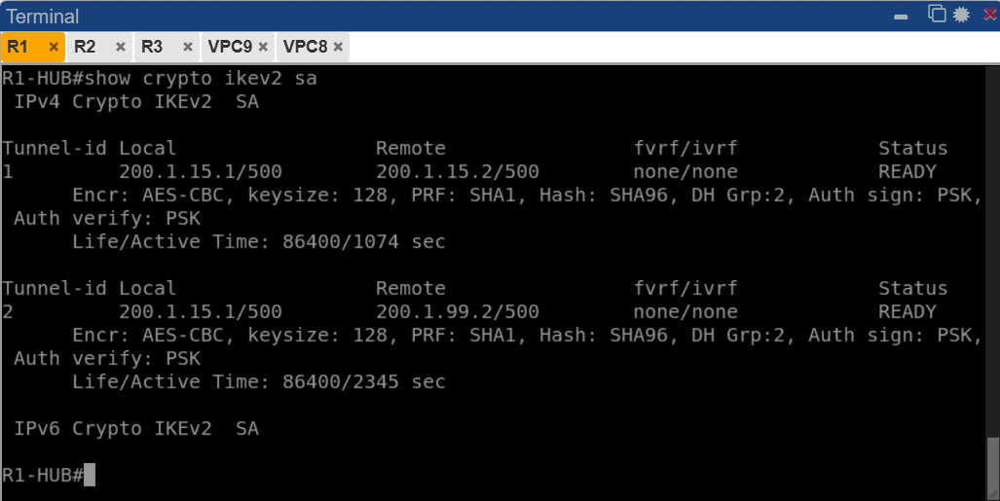

*IMAGEN2 — `show crypto ikev2 sa` en R1-HUB. Se muestran dos túneles IKEv2 en estado `READY`:*
- *Tunnel-id 1: `200.1.15.1 ↔ 200.1.15.2` (Hub ↔ R2 Spoke1) — activo 1074 seg*
- *Tunnel-id 2: `200.1.15.1 ↔ 200.1.99.2` (Hub ↔ R3 Spoke2) — activo 2345 seg*

*Cifrado AES-CBC-128, integridad SHA96, grupo DH 2, autenticación PSK en ambas direcciones. A diferencia de IKEv1 que muestra `QM_IDLE`, IKEv2 usa `READY` para indicar sesión activa y estable.*

---

### Estado DMVPN en R1 Hub — 2 Spokes UP

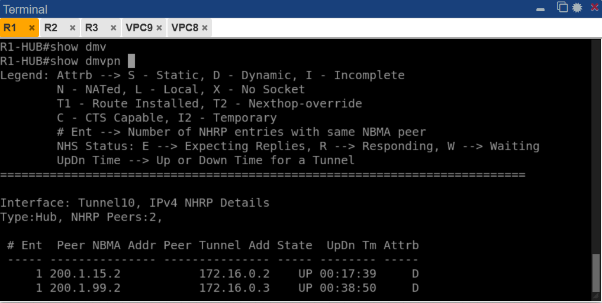

*IMAGEN3 — `show dmvpn` en R1-HUB. Tipo: Hub con 2 peers NHRP, ambos en estado UP con atributo D (Dynamic):*
- *`200.1.15.2 → 172.16.0.2` (R2 Spoke1) — activo 00:17:39*
- *`200.1.99.2 → 172.16.0.3` (R3 Spoke2) — activo 00:38:50*

*El Hub recibe los registros NHRP de ambos Spokes y mantiene la tabla de mapeo NBMA↔IP-túnel actualizada.*

---

### NHRP en R1 Hub — entradas dinámicas de ambos Spokes

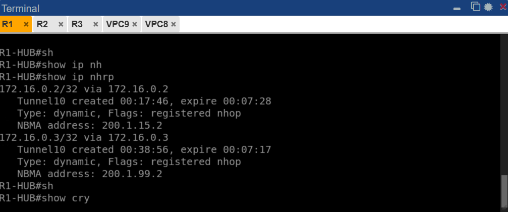

*IMAGEN4 — `show ip nhrp` en R1-HUB. El Hub conoce las IPs NBMA reales de ambos Spokes:*
- *`172.16.0.2/32` → NBMA `200.1.15.2` (R2) — Type: dynamic, registered, expire 00:07:28*
- *`172.16.0.3/32` → NBMA `200.1.99.2` (R3) — Type: dynamic, registered, expire 00:07:17*

*Estas entradas son creadas automáticamente cuando los Spokes se registran con el Hub (NHS).*

---

### Tabla de rutas EIGRP en R1 Hub

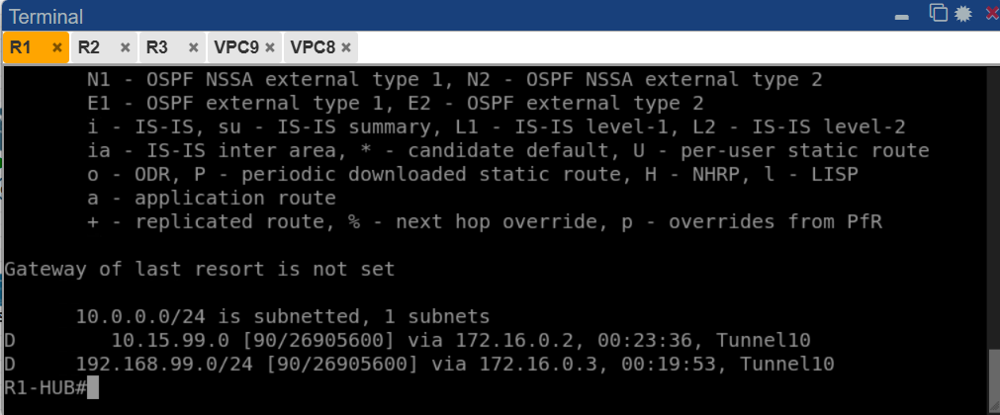

*IMAGEN5 — `show ip route eigrp` en R1-HUB. EIGRP AS 100 aprendió ambas LANs de los Spokes a través de Tunnel10:*
- *`D 10.15.99.0 [90/26905600] via 172.16.0.2` — LAN de R2 Spoke1*
- *`D 192.168.99.0 [90/26905600] via 172.16.0.3` — LAN de R3 Spoke2*

*El Hub tiene visibilidad completa de todas las redes del DMVPN.*

---

### IKEv2 SA en R2 Spoke1 — READY

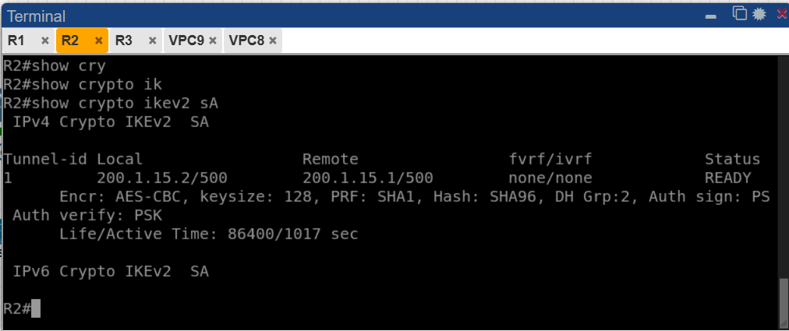

*IMAGEN6 — `show crypto ikev2 sa` en R2. Tunnel-id 1: `200.1.15.2 ↔ 200.1.15.1` en estado `READY`, activo 1017 seg. R2 se autentica exitosamente con el Hub usando IKEv2 PSK.*

---

### NHRP en R2 Spoke1 — entrada estática al Hub + atajo Spoke↔Spoke

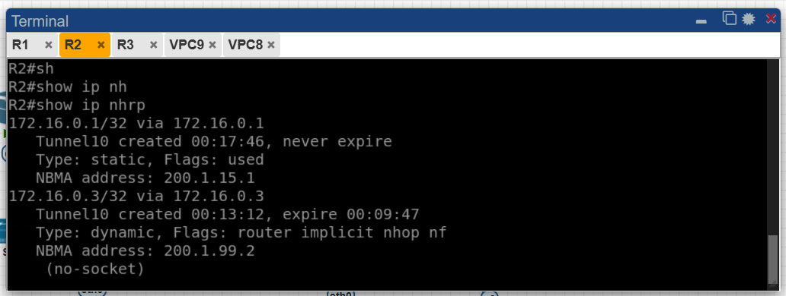

*IMAGEN7 — `show ip nhrp` en R2. Dos entradas:*
- *`172.16.0.1/32` → NBMA `200.1.15.1` — Type: static (configuración manual del NHS), never expire, `Flags: used` (está siendo utilizada activamente)*
- *`172.16.0.3/32` → NBMA `200.1.99.2` — Type: dynamic, `Flags: router implicit nhop nf` — **esta es la entrada de atajo Fase 3**: R2 aprendió la IP NBMA de R3 gracias al `nhrp redirect` del Hub, pero aún sin socket activo (`no-socket`)*

---

### DMVPN en R2 Spoke1 — atributo DX confirma Fase 3

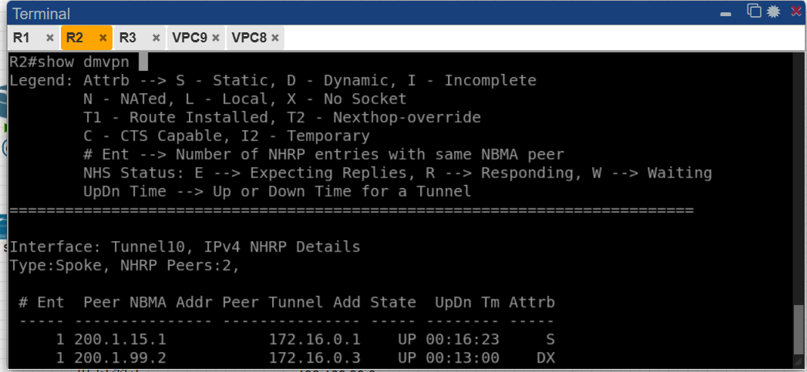

*IMAGEN8 — `show dmvpn` en R2. Tipo: Spoke con 2 peers:*
- *`200.1.15.1 → 172.16.0.1` — Hub, UP 00:16:23, atributo `S` (Static)*
- *`200.1.99.2 → 172.16.0.3` — R3 Spoke2, UP 00:13:00, atributo `DX`*

*El atributo `DX` (Dynamic + shortcut) es exclusivo de Fase 3 y confirma que R2 estableció un túnel directo con R3 usando el mecanismo de atajo NHRP. En Fase 2 este atributo sería solo `D`.*

---

### IKEv2 SA en R3 Spoke2 — READY

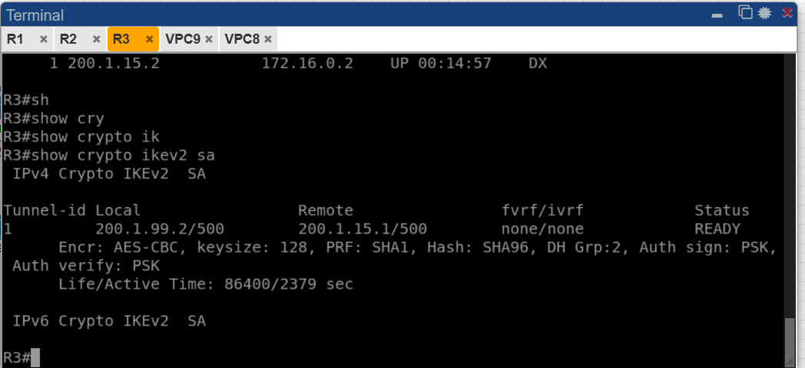

*IMAGEN9 — `show crypto ikev2 sa` en R3. Tunnel-id 1: `200.1.99.2 ↔ 200.1.15.1` en estado `READY`, activo 2379 seg. R3 negoció IKEv2 correctamente con el Hub usando su IP NBMA (`200.1.99.2`) hacia la IP fuente del Tunnel10 del Hub (`200.1.15.1`).*

---

### DMVPN en R3 Spoke2 — atributo DX confirma atajo Fase 3

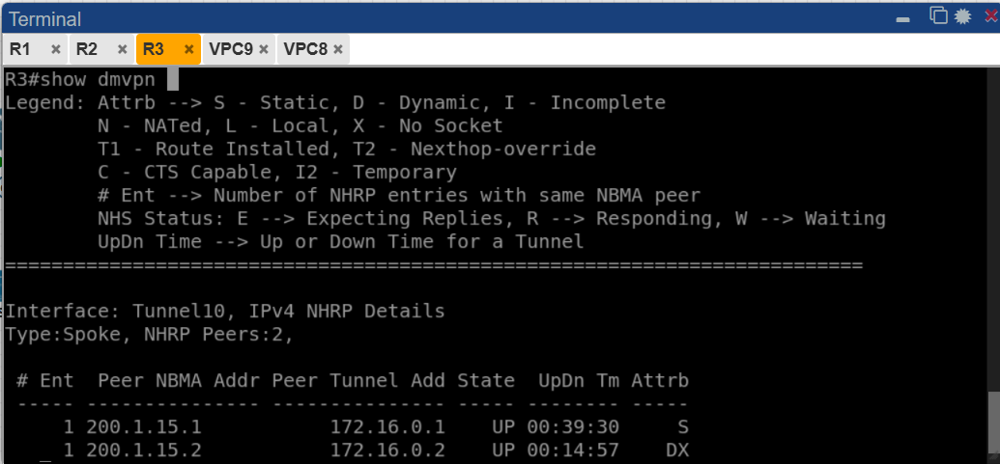

*IMAGEN10 — `show dmvpn` en R3. Tipo: Spoke con 2 peers:*
- *`200.1.15.1 → 172.16.0.1` — Hub, UP 00:39:30, atributo `S` (Static)*
- *`200.1.15.2 → 172.16.0.2` — R2 Spoke1, UP 00:14:57, atributo `DX`*

*El atributo `DX` en R3 confirma que también estableció el túnel directo con R2, completando el mecanismo bidireccional de atajos Fase 3.*

---

### NHRP en R3 Spoke2 — entrada estática al Hub + atajo a R2

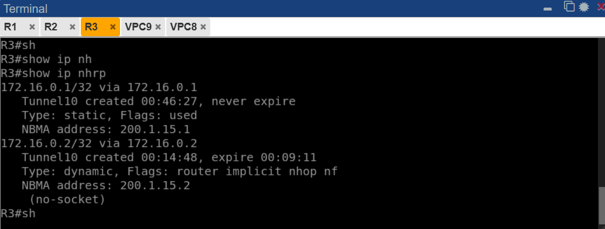

*IMAGEN11 — `show ip nhrp` en R3. Dos entradas:*
- *`172.16.0.1/32` → NBMA `200.1.15.1` — Type: static, never expire, `Flags: used` (NHS activo)*
- *`172.16.0.2/32` → NBMA `200.1.15.2` — Type: dynamic, `Flags: router implicit nhop nf`, expire 00:09:11 — entrada de atajo Fase 3 que apunta a R2 Spoke1*

---

### Ping VPC9 → VPC8 (Spoke2 → Spoke1)

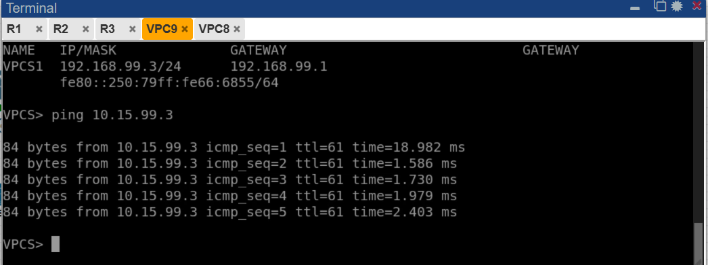

*IMAGEN12 — Ping desde VPC9 (`192.168.99.3`) hacia VPC8 (`10.15.99.3`). El primer paquete tarda ~18ms (negociación del atajo NHRP Fase 3 + IKEv2 Spoke↔Spoke); los siguientes tienen latencia de ~2ms, confirmando que el tráfico viaja por el túnel directo R3↔R2 sin pasar por el Hub.*

---

### Ping VPC8 → VPC9 (Spoke1 → Spoke2)

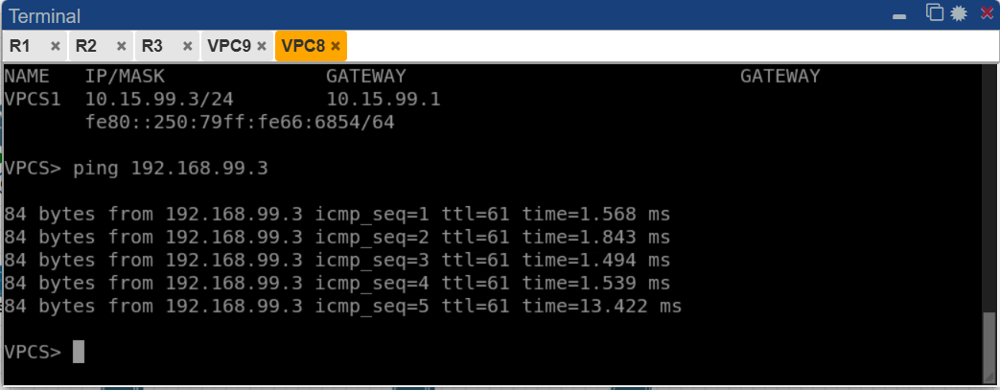

*IMAGEN13 — Ping desde VPC8 (`10.15.99.3`) hacia VPC9 (`192.168.99.3`). Resultado: 5/5 paquetes exitosos con latencia promedio ~2ms (último paquete ~13ms por rotación de timer). Conectividad bidireccional confirmada entre ambas LANs a través del DMVPN Fase 3 con IKEv2.*

---

## Resumen de verificación

| Verificación | Comando | Resultado | Estado |
|---|---|---|---|
| IKEv2 SA Hub (x2) | `show crypto ikev2 sa` | Tunnel-id 1 y 2 en READY | ✓ |
| DMVPN Hub — 2 Spokes UP | `show dmvpn` | 200.1.15.2 y 200.1.99.2 UP (D) | ✓ |
| NHRP Hub — 2 entradas dinámicas | `show ip nhrp` | 172.16.0.2 y 172.16.0.3 registered | ✓ |
| Rutas EIGRP Hub | `show ip route eigrp` | 10.15.99.0 y 192.168.99.0 aprendidas | ✓ |
| IKEv2 SA R2 | `show crypto ikev2 sa` | READY | ✓ |
| NHRP R2 — atajo Fase 3 | `show ip nhrp` | 172.16.0.3 dynamic (implicit nhop) | ✓ |
| DMVPN R2 — atributo DX | `show dmvpn` | 200.1.99.2 UP atributo DX | ✓ |
| IKEv2 SA R3 | `show crypto ikev2 sa` | READY | ✓ |
| DMVPN R3 — atributo DX | `show dmvpn` | 200.1.15.2 UP atributo DX | ✓ |
| NHRP R3 — atajo Fase 3 | `show ip nhrp` | 172.16.0.2 dynamic (implicit nhop) | ✓ |
| Ping VPC9 → VPC8 | `ping 10.15.99.3` | 5/5 exitosos ~2ms | ✓ |
| Ping VPC8 → VPC9 | `ping 192.168.99.3` | 5/5 exitosos ~2ms | ✓ |

---

## Notas técnicas

- El atributo `DX` en `show dmvpn` de los Spokes es la evidencia visual definitiva de que Fase 3 está activa. En Fase 2 el atributo sería solo `D`.
- El primer ping entre Spokes tarda ~18ms: ese tiempo corresponde al intercambio NHRP Resolution Request/Reply + negociación IKEv2 del túnel directo Spoke↔Spoke. Los pings siguientes van por el atajo ya establecido (~2ms).
- La SA IPSec directa entre Spokes (`show crypto ipsec sa peer 200.1.99.2` desde R2) mostrará `pkts encaps: 0` hasta que haya tráfico real — es comportamiento normal en Fase 3 ya que los túneles directos se crean bajo demanda.
- `ip nhrp redirect` en el Hub y `ip nhrp shortcut` en los Spokes son las **dos únicas líneas** que diferencian Fase 3 de Fase 2 en la configuración del Tunnel10.
- El perfil IPSec **debe incluir** `set ikev2-profile DMVPN-IKE`. Sin esa línea, IKEv2 está configurado pero no participa en la protección del túnel GRE.
- R3 usa `200.1.99.1` como gateway pero se registra con el Hub usando `200.1.15.1` como NHS NBMA, porque la fuente del Tunnel10 del Hub es `e0/0` (`200.1.15.1`). R1 enruta internamente entre sus dos interfaces WAN.
